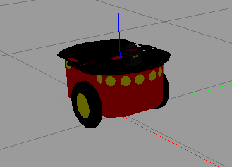
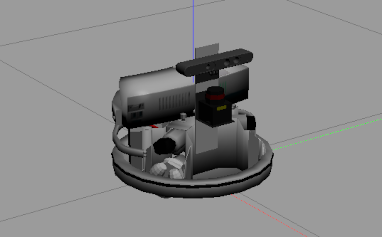
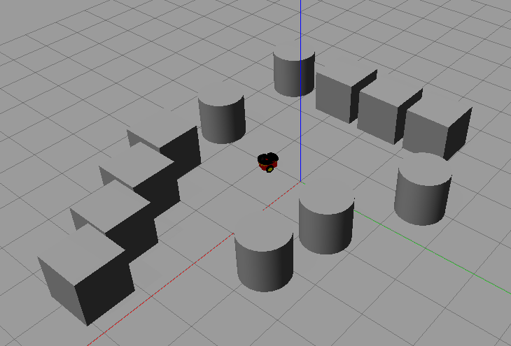

# Practical Course: Intelligent Mobile Robots with ROS (PCIMR)

## Tutorial 02: Robot HW & Kinematics

### Introduction

The creation of this package was part of the second exercise in the practical course 'Intelligent Mobile Robots with ROS' and is based on the topics of the second lecture.

The package contains a velocity controller node that subscribes to the topics /input/cmd_vel and /scan. The messages in the topic /input/cmd_vel are twist messages published by the teleop_twist_keyboard node.
The velocity controller modifies these messages based on the output of the laser scanner - which publishes on the topic /scan - and publishes these modified twist messages on either the topic /pioneer/cmd_vel or /cmd_vel, depending 
on the robot that has been defined for the simulation via the environment variable ROBOT.

In order to adjust the linear velocity of the robot based on the measured distance to objects, a velocity model is implemented. Of the several existing velocity models - e.g. tanh-based velocity model or step velocity model - the velocity controller in this package is based on the linear velocity model.

Since the velocity controller should work for the Pioneer (p3dx) and for the Robotino (rto-1), robots with differential drive and robots with omnidirectional drive should be considered. The Pioneer has two driven wheels and one caster wheel. This allows the Pioneer to have a turn radius of basically zero. The Robotino, on the other hand, utilizes omniwheels, which enable the robot to also perform lateral motions. The visualization of the two robots in the Gazebo simulation environment is depicted below. 

  
<table style="margin-left: auto; margin-right: auto; table-layout: fixed; width: 100%">
  <tr>
    <td style="width: 30%;"> </td>
    <td style="width: 30%;">  </td>
  </tr>
  <tr>
    <td style="width: 30%;" valign="top">  <b>Fig.1:</b> Pioneer (p3dx)</td>
    <td style="width: 30%;" valign="top">  <b>Fig.2:</b> Robotino (rto-1)</td>
  </tr>
</table>

The robot is maneuvered in a Gazebo simulation environment consisting of simple boxes and cylinders. This is sufficient for the sake of testing the velocity controller.
Figure 3 shows the Pioneer located in this simple simulation environment.

<figure>
  
  <figcaption> <b>Fig.3:</b> Gazebo simulation environment</figcaption>
</figure> 

### Code Overview

After the first task, which was to implement the velocity controller for the Pioneer, the velocity controller should be modified so that it also worked for the Robotino.
In the course of this second task a few questions were to be answered:

1. Does the velocity controller work out of the box?

<i>No, the velocity controller does not work out of the box. The automatic deceleration of the robot still works in the robots x-direction, but as the Robotino can also make lateral movements, the robot will crash into an obstacle when moving in its y-direction.</i>

2. What should be updated and why did it not work out of the box?

<i> The velocity controller did not work right out of the box, because the Pioneer is only able to move in its x-direction. Therefore an automatic control for 'sideways' movements was not necessary for robots with differential drive. The velocity controller should be updated in order to also consider lateral movements.</i>

For a smooth launch of the necessary components a launch file was created. The launch file launches the robot.launch launch file of the rto_bringup_sim package, the velocity controller node of the rto_velocity_controller package and the teleop twist keyboard node of the teleop_twist_keyboard package. Furthermore, the launch file also acts as a parameter server that stores private parameters of the velocity controller node.
To launch all the necessary components, the following line has to be executed in the terminal:

    roslaunch rto_velocity_controller velocity_controller.launch 

Since the laser scanners of these robots are only able to scan a field of 240 degrees, it is impossible to prevent the robot from crashing when it moves backwards. To compensate for this, the robots velocity when driving in negative x-direction is strongly restricted.

